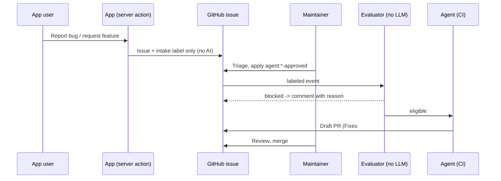

# Agentic AI Starter (white-label)

A standalone reference implementation of six agentic AI patterns for a member-community app. Rebrand it with environment variables and CSS tokens. It runs fully offline: without API keys you get a deterministic AI mock and dry-run GitHub previews.

| | |
|---|---|
| **Purpose** | Reusable starting point and demo for in-product AI and human-gated coding agents |
| **Scope** | Sample-grade reference code. Not production-ready until the items under [Before production](#before-production) are done |
| **Stack** | Next.js 16 (App Router, Server Actions), React 19, TypeScript, Tailwind 4, Zod 4, Vitest 5, Anthropic SDK |
| **Dependencies** | Anthropic API (optional), GitHub REST API (optional), GitHub Actions + `anthropics/claude-code-action@v1` |
| **Repository** | [github.com/Muhammad-UmairAli/agentic-ai-starter](https://github.com/Muhammad-UmairAli/agentic-ai-starter) |
| **Maintainer** | [@Muhammad-UmairAli](https://github.com/Muhammad-UmairAli) |
| **License** | [MIT](LICENSE) |

Full re-implementation specs for every feature are in [`docs/`](docs/README.md).

## Quick start

Requires Node.js 22+.

```bash
git clone https://github.com/Muhammad-UmairAli/agentic-ai-starter.git
cd agentic-ai-starter
npm install
cp .env.example .env.local   # optional: add ANTHROPIC_API_KEY / GITHUB_TOKEN
npm run dev                  # http://localhost:3000
npm test                     # offline, always uses the mock
npm run lint && npm run typecheck
```

To enable the CI agents in your own copy, add an `ANTHROPIC_API_KEY` repository secret and create the `agent:*` labels described in [docs/features/00-operating-model.md](docs/features/00-operating-model.md). Without that secret, the agent workflows fail and nothing else is affected.

## Use cases

### In the app

| # | Pattern | Where | What it shows |
|---|---|---|---|
| 1 | **AI message composer** | `/composer`, `src/lib/composer.ts` | Authorize, then rate-limit, screen the input, generate with structured output, and screen the output. Facts come from data the caller may see; the user draft goes in tags as data; output is rendered as text |
| 2 | **Moderation pipeline** | `/moderation`, `src/lib/moderation.ts` | Suspension check, then word list, then AI classifier. Fails closed and has a kill switch. Sliding-window strikes (>3 in 30 min, >10 in 24 h) pause posting everywhere |
| 3 | **Feedback intake for agents** | `/feedback`, `src/lib/feedback.ts` | Bug and feature issues. Logs are redacted on the client and again on the server, `@mentions` and hidden HTML comments are neutralized, attachment hosts are allowlisted, and the reporter is an opaque ID |
| 4 | **What's New** | `/whats-new` | `feat`/`fix` Conventional Commits from the release branch, behind a 5-minute server cache |

### In CI (`.github/workflows`, `.claude/skills`)

| # | Pattern | Trigger | Output |
|---|---|---|---|
| 5 | **Human-gated issue agents** | Maintainer applies `agent:autofix-approved`, `agent:plan-approved` or `agent:implement-approved` | The deterministic evaluator (`scripts/evaluate-issue.mjs`) runs first. Then an agent opens a draft PR (autofix/implement) or writes a PRD and tasks onto the issue (plan) |
| 6 | **AI PR review + @mention** | PR opened/updated; `@claude` comment from a repo member | Summary and inline review comments; read-only answers |



## Rebranding

- `NEXT_PUBLIC_BRAND_NAME` sets the name in the header and page title.
- `src/app/globals.css` `:root` tokens set colors for light and dark mode.
- `src/lib/ai.ts` system prompts set the voice of AI output.
- `src/lib/demo-data.ts` holds synthetic groups and events. Replace it with your data layer.

## Security model

- **No AI on user submit.** Agents start only from a maintainer's label (the `labeled` event, never `opened`). claude-code-action also checks that the labeler has write access.
- **Untrusted text is never part of the workflow prompt.** Agents fetch issues with `gh issue view`, and the skills treat the body as data.
- **Least privilege per mode.** Tool allowlists exclude `node -e`, `npx` and network tools, and agents can push only to `agent/*` branches. Protect `main` with required reviews.
- **Fail closed.** If moderation is down, nothing gets posted.
- **Secrets** live in `.env.local` (gitignored). `.claude/settings.json` blocks agents from reading or editing it.

## Before production

1. Replace `src/lib/session.ts` with real auth (e.g. Auth.js with Microsoft Entra ID, or Amazon Cognito).
2. Move `SlidingWindow` (rate limits, strikes) and the changelog cache to Redis or a database. Today they are per-process.
3. Persist moderation events (user ID, surface, categories, timestamp, no raw text unless policy requires it) with a retention policy.
4. Get product and legal sign-off on the word list and on moderation thresholds, especially for minors (COPPA / GDPR-K review).
5. Pin GitHub Actions to commit SHAs and restrict who can apply `agent:*` labels.
6. Add evals for the composer and classifier prompts before changing models or prompts.
7. Check the Claude Code permission patterns in the workflow allowlists (`git push origin agent/*`) on a first dry run.

## License

[MIT](LICENSE)
