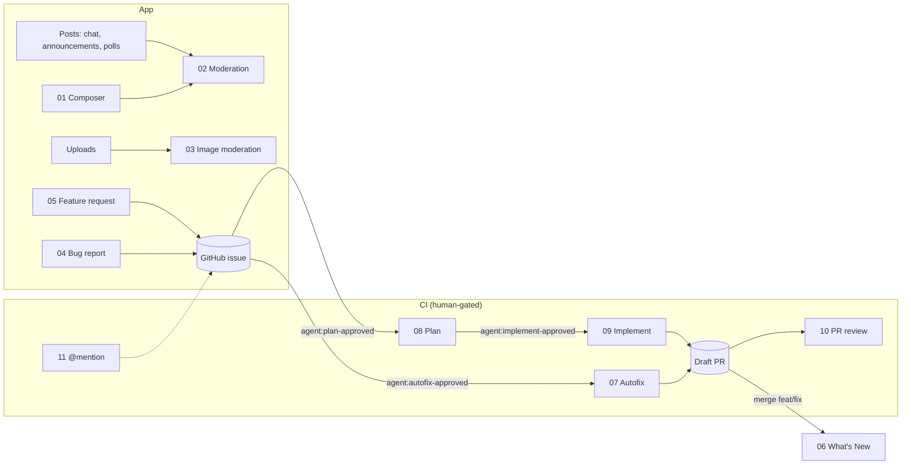

# Feature specifications

These specs describe each agentic AI feature in enough detail to rebuild it in a new project on any stack, without the source system that inspired it. They are white-label: generic product terms, synthetic examples, no customer data.

| | |
|---|---|
| **Purpose** | Durable, re-implementable reference for every AI feature in this kit |
| **Audience** | Engineers and tech leads starting a new project; reviewers checking a re-implementation |
| **Assumptions** | A web or mobile client, a server you control, GitHub for source control and issues, an LLM provider with structured outputs |
| **Owner** | _TBD: assign before reuse_ |
| **Last reviewed** | 2026-10-01 |

## Index

| # | Feature | Kind | In this sample |
|---|---|---|---|
| 00 | [Operating model](features/00-operating-model.md) | Process | Labels, roles, SOP |
| 01 | [AI message composer](features/01-ai-message-composer.md) | LLM workflow | `src/lib/composer.ts`, `/composer` |
| 02 | [Text moderation and strikes](features/02-text-moderation.md) | LLM classifier pipeline | `src/lib/moderation.ts`, `/moderation` |
| 03 | [Image moderation on upload](features/03-image-moderation.md) | Vendor ML | Spec only |
| 04 | [Bug report intake](features/04-bug-report-intake.md) | Agent enabler | `src/lib/feedback.ts`, `/feedback` |
| 05 | [Feature request intake](features/05-feature-request-intake.md) | Agent enabler | `src/lib/feedback.ts`, `/feedback` |
| 06 | [What's New changelog](features/06-whats-new-changelog.md) | Loop closure | `getChangelog()`, `/whats-new` |
| 07 | [Bug autofix agent](features/07-agent-bug-autofix.md) | Agentic (CI) | `agent-issues.yml` (autofix mode) |
| 08 | [Feature planning agent](features/08-agent-feature-plan.md) | Agentic (CI) | `agent-issues.yml` (plan mode) |
| 09 | [Feature implementation agent](features/09-agent-feature-implement.md) | Agentic (CI) | `agent-issues.yml` (implement mode) |
| 10 | [AI pull request review](features/10-agent-pr-review.md) | Agentic (CI) | `agent-pr-review.yml` |
| 11 | [Interactive @mention agent](features/11-agent-mention.md) | Agentic (CI) | `agent-mention.yml` |
| 12 | [Coding-agent guardrails](features/12-coding-agent-guardrails.md) | Dev tooling | `.claude/`, `AGENTS.md` |

## Spec template

Every feature file uses the same sections, so specs are easy to compare and check:

1. **Purpose**: the problem and the outcome.
2. **Status in this sample**: implemented where, or spec only.
3. **User flow**: step by step.
4. **Functional rules**: numbered and testable. "R3" in a test name points here.
5. **Data contracts**: requests, responses, records.
6. **AI design**: model role, prompt structure, output schema, effort (where applicable).
7. **Security and privacy**: controls and why each exists.
8. **Failure modes**: what breaks, what the user sees, what is logged.
9. **Configuration**: settings and defaults.
10. **Acceptance checks**: what to test before calling it done.
11. **Rebuild checklist**: stack-agnostic steps.
12. **Pitfalls**: mistakes the source system made, or nearly made.

Values marked _default_ are starting points to tune per product, not requirements. Anything marked **Decision** needs an owner's sign-off (product, legal or security) in each new project.
