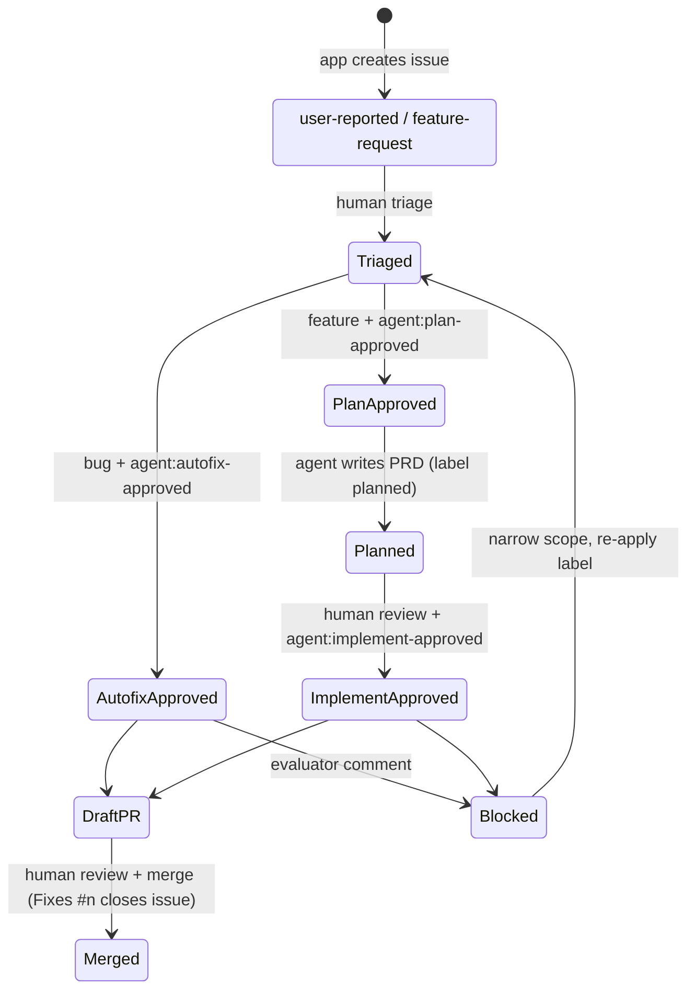

# 00 · Operating model for human-gated AI

How people and agents work together across features 04-11. Technical controls only work when someone owns them.

## Principles

1. **No AI on user submit.** End users create issues. Only maintainers start agents.
2. **Deterministic checks before LLM spend.** A free script blocks oversized or risky work before any model runs.
3. **Agents propose, humans dispose.** Agents open draft PRs or write plans. Humans merge, close and deploy.
4. **The same review bar for everyone.** Agent PRs go through the same review rubric and CI as human PRs.
5. **Close the loop.** Merged user-facing changes show up in What's New (06), so reporters see results.

## Roles

| Role | Responsibilities |
|---|---|
| **Triager** (support or product, rotating) | Reviews the `user-reported` and `feature-request` queues daily: dedupes, asks for details, sets priority |
| **Approver** (engineer with Triage+ repo role) | Applies `agent:*-approved` labels. Reads the *raw* issue body (Edit view) before approving, because hidden comments don't show in the rendered view |
| **Reviewer** (code owner) | Reviews agent PRs like any other, takes them out of draft, merges |
| **Agent owner** (tech lead) | Owns workflow config, skills, budgets and the metrics below. Reviews blocked-issue comments for false blocks |
| **Security contact** | Approves changes to tool allowlists, permissions and secrets |

## Label lifecycle

| Label | Set by | Meaning |
|---|---|---|
| `user-reported` | App | Bug intake queue |
| `feature-request` | App | Feature intake queue |
| `area:<id>` | App | Product area, used for filtering and agent scope. Create these labels up front |
| `agent:autofix-approved` | Human | Run the bug autofix agent (07). Bugs only |
| `agent:plan-approved` | Human | Run the planning agent (08). Features only |
| `planned` | Agent | Plan written onto the issue |
| `agent:implement-approved` | Human | Run the implementation agent (09) on a planned feature |

## Branching

- Agents work on `agent/issue-<n>` (autofix) or `agent/feature-<n>` (implement), and open **draft** PRs into the integration branch.
- Protect the integration and release branches: required reviews, required CI, no force-push. Branch protection is the real control. Prompt instructions are not.
- Agent PRs must include `Fixes #<n>` so merging closes the issue.

## Rollout checklist

- [ ] Create every label above, including one `area:*` per product area
- [ ] Set the `ANTHROPIC_API_KEY` repo secret from an **organization** workspace with a spend limit (not a personal subscription token)
- [ ] Workflow permissions: Actions can create PRs; branch protection is in place
- [ ] Limit who holds the Triage role or higher, since that role can apply labels
- [ ] Bot account and fine-grained token for intake (Issues read/write on one repo)
- [ ] Dry-run each workflow in a scratch repo, including a deliberately blocked issue
- [ ] Name the people in each role above

## Metrics to watch

| Metric | Why |
|---|---|
| Intake volume per week, and the share that is duplicates or spam | Triage load and intake quality |
| Evaluator block rate and false-block rate | Guardrail tuning |
| Agent completion rate (PR opened / runs) and merge rate (merged / PRs) | Whether agents earn their cost |
| Median time from report to merged fix | The business outcome |
| Spend per run and per merged PR | Budget control |
| Review findings per agent PR, compared with human PRs | Quality |

## Budgets (defaults)

| Mode | Max turns | Timeout |
|---|---|---|
| Autofix | 40 | 60 min |
| Plan | 40 | 60 min |
| Implement | 80 | 60 min |
| PR review | 40 | 30 min |
| Mention | 20 | 20 min |

Start low and raise only when metrics show runs being cut off. Keep the docs and the workflow numbers in sync.
