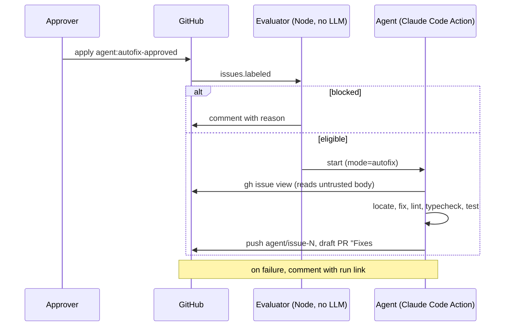

# 07 · Bug autofix agent

## 1. Purpose
For small, well-understood bugs, let a coding agent investigate, fix, test, and open a **draft** PR after a human approves. Engineers review instead of writing.

## 2. Status in this sample
Implemented: `.github/workflows/agent-issues.yml` (autofix mode), `scripts/evaluate-issue.mjs`, `.claude/skills/issue-autofix/SKILL.md`. **Not yet dry-run** in a real repo.

## 3. Flow

## 4. Functional rules
- **R1 Trigger:** `issues: labeled` with `agent:autofix-approved` **only**, never `opened`. An issue created with the label already on would otherwise skip triage.
- **R2 Actor check:** the action refuses to run unless the labeler has write access. Also limit the Triage role or higher to trusted people.
- **R3 Evaluator** (free, deterministic). It blocks when:
  - the body is over 12,000 characters
  - the issue isn't a bug (needs `user-reported` or `bug`), or it is a `feature-request`
  - it references more than **6** distinct file paths (git `a/` and `b/` prefixes count once)
  - it touches a high-risk area, matched on **paths and artifacts, not English words** (so "the production environment" in prose doesn't block a copy fix): `.sql`, `migrations/`, `.github/`, `.env`, `infra/`, `terraform/`, `bicep/`, `cdk/`, `helm/`, `package-lock.json`, `Dockerfile`

  When it blocks, it posts the reason and how to proceed: narrow the scope and re-apply the label.
- **R4 Prompt:** contains **only** the issue number and repo. The agent fetches the issue itself and the skill marks the body as untrusted. Never paste the body into the prompt: delimiters can be spoofed, and HTML comments are invisible to the approver.
- **R5 Skill steps:**
  1. Triage. If it's a duplicate, spam, a question or vague, comment and stop.
  2. Start in the **Investigation scope** paths (04 R10).
  3. Make the smallest fix, adding a test when the logic is non-trivial.
  4. Run lint, typecheck and tests.
  5. Branch `agent/issue-N`, commit with Conventional Commits (`fix:` if user-facing).
  6. Push, open a **draft** PR to the integration branch with `Fixes #N`, a summary and verification notes.
  7. Comment the PR link on the issue.
- **R6 Stop and comment instead** when the fix needs more than ~10 files, a migration, infrastructure, CI, secrets or env changes, or the cause can't be found with reasonable confidence.
- **R7 Tool allowlist (least privilege):** Read/Grep/Glob/Edit/Write; `gh issue view|comment`, `gh pr create`; `git checkout -b|add|commit|status|diff`, `git push origin agent/*`; the project's lint, typecheck and test scripts. **Excluded:** `node -e`, `npx`, `curl`, broad `gh`/`git`, package installs.
- **R8 Budgets:** 40 turns, 60-minute timeout. Concurrency is one run per issue, and a newer run cancels the older one.
- **R9 Failure:** comment on the issue with the run URL.

## 5. Data contracts
Evaluator output (`$GITHUB_OUTPUT`): `mode`, `eligible`, `reason`. The draft PR body includes `Fixes #N`, a summary, and how it was verified.

## 6. AI design
A true agent: open-ended exploration plus tool use, which justifies the agent tier because fixes are hard to specify up front and errors are caught by CI and review. Model `claude-opus-5-5`. The skill file is the "program"; keep it short and procedural.

## 7. Security and privacy
| Threat | Control |
|---|---|
| Prompt injection from end-user text | Neutralized at intake (04 R7); body not in the prompt (R4); skill says the body is data |
| Code execution through the agent | Narrow allowlist (R7); ephemeral runner; job-scoped token |
| Pushing to protected branches | Branch protection, deny rules, `agent/*` push pattern |
| Cost runaway | Label gate, evaluator, turn and time budgets, org API key with spend limit |
| Secrets exposure | Secrets only on agent steps; fork PRs never get secrets |

## 8. Failure modes
Blocked by evaluator: comment with reason. Turn or time budget hit: failure comment. Can't reproduce: triage comment and no PR.

## 9. Configuration
Secret `ANTHROPIC_API_KEY`. Labels per 00. Evaluator limits are in `LIMITS` and `HIGH_RISK` in `scripts/evaluate-issue.mjs`.

## 10. Acceptance checks
- Evaluator unit tests (tested).
- Scratch-repo dry run: a typo bug produces a draft PR with `Fixes #N`.
- A migration bug is blocked with a comment.
- An issue body with a hidden comment containing instructions has no effect.
- A label applied by a non-writer doesn't run.

## 11. Rebuild checklist
1. Write the evaluator script with tests.
2. Write the workflow with the labeled trigger, evaluate job, agent job and failure comment.
3. Write the skill.
4. Create the labels, secret and branch protection.
5. Dry-run with good, risky and malicious issues.
6. Put the metrics in 00 on a dashboard.
